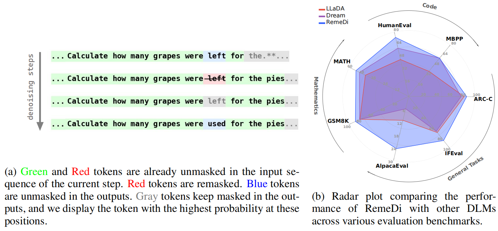
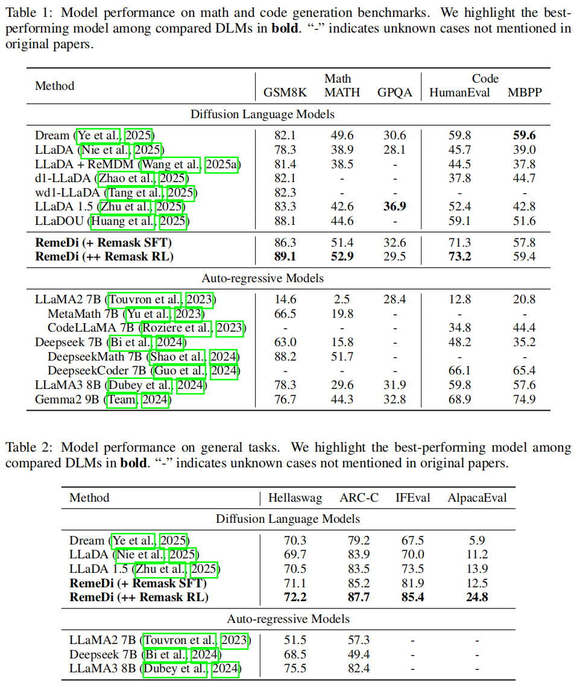

# RemeDi: <u><b>Rem</b></u>asking-<u><b>e</b></u>nabled <u><b>Di</b></u>ffusion Language Model


<div align="center">


[](https://mp.weixin.qq.com/s/UefnjlCSi6YvzVe-Xu9jjQ)
[](https://arxiv.org/abs/2509.23653)&#160;

[-yellow?logoColor=violet&label=%F0%9F%A4%97%20RemeDi-Instruct%20checkpoint)](https://huggingface.co/maple-research-lab/RemeDi-Instruct)&#160;
[-yellow?logoColor=violet&label=%F0%9F%A4%97%20RemeDi-RL%20checkpoints)](https://huggingface.co/maple-research-lab/RemeDi-RL)&#160;
<!--[](https://maple-aigc.github.io/SIM)&#160; -->


</div>


# 🚧 Update Progress


**[2026-1-28]**  

- Model weights for RemeDi have been uploaded to HuggingFace (see resource links below).
- Inference code is released.

# 🔬 Method Overview

RemeDi lets every token be revised at every diffusion step. Instead of fixing in an early guess, the model evaluates the quality of each token and can remask low-confidence positions, allowing later steps to resample them with richer context—built-in self-correction.

RemeDi extends the original model with a dual-stream transformer:

- Token Prediction Stream (TPS) predicts masked tokens as usual.

- Unmasking Policy Stream (UPS) outputs per-token confidence scores, deciding which tokens to unmask or remask.


At each denoising step, tokens with low confidence can be remasked and resampled, enabling iterative refinement.
For the training and RL algorithms, see the Methods section of the paper.

<p align="center">
  <!-- Replace with the actual image path -->
  
</p>


# 📈 Key Results


<p align="center">
  <!-- Replace with the actual image path -->
  
</p>


# 📂 Repository Structure

```
├── inference.py     # inference scripts
├── remedi/          # networks configs 
└── README.md
```

<!-- ⸻ -->

<!-- # 🔗 Resources

- Paper: [DON'T SETTLE TOO EARLY: SELF-REFLECTIVE REMASKING FOR DIFFUSION LANGUAGE MODELS](https://arxiv.org/abs/2509.23653)

- Models: 

  - Instruct: [maple-research-lab/RemeDi-Instruct](https://huggingface.co/maple-research-lab/RemeDi-Instruct)

  - RL: [maple-research-lab/RemeDi-RL](https://huggingface.co/maple-research-lab/RemeDi-RL) -->


# 📥 Citation

```
@article{huang2025don,
  title={Don't Settle Too Early: Self-Reflective Remasking for Diffusion Language Models},
  author={Huang, Zemin and Wang, Yuhang and Chen, Zhiyang and Qi, Guo-Jun},
  journal={arXiv preprint arXiv:2509.23653},
  year={2025}
}
```

